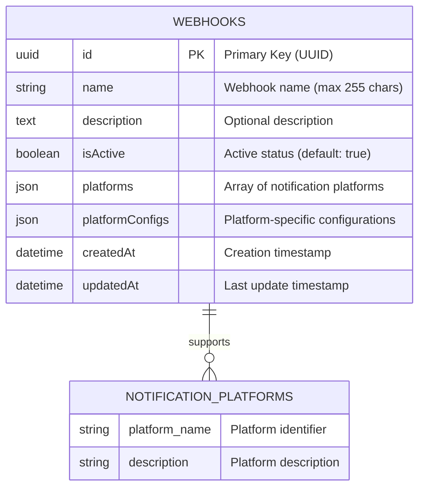

# Database Schema

This document describes the database schema for the Notify-Webhook application.

## Database Technology

- **Database**: SQLite
- **ORM**: TypeORM
- **File Location**: `backend/database.sqlite`

## Entity Relationship Diagram



## Tables

### webhooks

The main table storing webhook configurations.

| Column | Type | Constraints | Description |
|--------|------|-------------|-------------|
| id | UUID | PRIMARY KEY | Unique identifier for the webhook |
| name | VARCHAR(255) | NOT NULL | Human-readable name for the webhook |
| description | TEXT | NULLABLE | Optional description of the webhook's purpose |
| isActive | BOOLEAN | NOT NULL, DEFAULT true | Whether the webhook is active and can receive notifications |
| platforms | JSON | NOT NULL | Array of supported platforms (discord, line, telegram) |
| platformConfigs | JSON | NOT NULL | Platform-specific configuration objects |
| createdAt | DATETIME | NOT NULL | Timestamp when the webhook was created |
| updatedAt | DATETIME | NOT NULL | Timestamp when the webhook was last updated |

## Supported Platforms

The application supports the following notification platforms:

- **discord**: Discord webhooks
- **line**: LINE Notify
- **telegram**: Telegram Bot API

## Platform Configuration Examples

### Discord Configuration
```json
{
  "discord": {
    "webhookUrl": "https://discord.com/api/webhooks/123456789/abcdef",
    "username": "Notify Bot",
    "avatarUrl": "https://example.com/avatar.png"
  }
}
```

### LINE Configuration
```json
{
  "line": {
    "accessToken": "your-line-notify-token",
    "stickerPackageId": 446,
    "stickerId": 1988
  }
}
```

### Telegram Configuration
```json
{
  "telegram": {
    "botToken": "your-bot-token",
    "chatId": "chat-id-or-username",
    "parseMode": "Markdown"
  }
}
```

## Database Initialization

The database is automatically created and synchronized when the application starts using TypeORM's `synchronize: true` option (development only).

For production deployments, you should:
1. Set `synchronize: false`
2. Use TypeORM migrations
3. Use a more robust database like PostgreSQL or MySQL